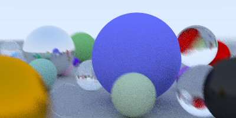

# raytracer-swift

Zero-dependency, concurrent raytracer written in Swift. A simple weekend experiment following the excellent book at https://raytracing.github.io/.

Features:
- Positionable camera with Depth of Field and Field of View.
- Three kinds of materials: Lambertian, Dielectric and Metal.
- Configurable antialiasing.
- Optimized to make use of all available cores.
- Outputs Portable Bitmap Format files.

Usage:

Setup your scene in the `main.swift` file and run:

```
swift run > result.ppm
```

## Samples per pixel

You can configure the quality via the `samplesPerPixel` parameter.

### Samples per pixel: 2


### Samples per pixel: 4


### Samples per pixel: 16


### Samples per pixel: 32


